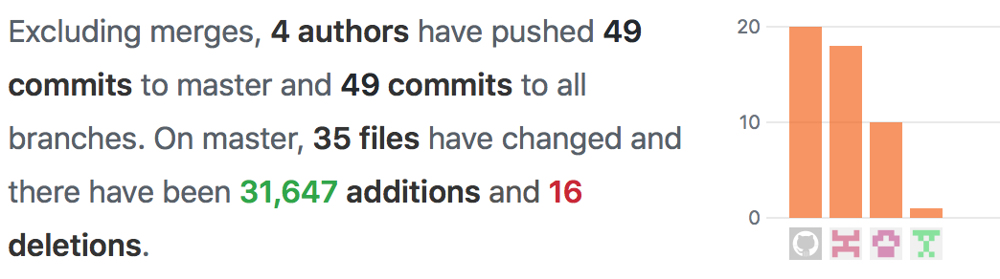

OSS 메뉴얼 작성 프로젝트
===
### CLOVA API를 선택한 이유는?
---
이세돌과 알파고의 대결 이후 알파고 쇼크가 화두로 떠오르면서 인공지능 시대가 도래했다. 사람들이 인공지능에 관심을 갖고 이에 따라 시중에 인공지능을 접목 시킨 상품들이 많이 출시되고, 아이폰X의 FACE 인식, AI 스피커 등과 같이 우리의 일상에 점차 많은 영향을 주고있어서 관심을 갖게 됬고, 앞으로 인공지능에 대한 중요도는 점차 높아질 것 이라고 생각했다. 물론 CLOVA는 추론이 가능한 인공지능 API는 아니지만 인공지능 현실화시키는 붓 정도로 생각 할 수 있다. 그래서 앞으로 열릴 대 인공지능 시대에 발을 맞추고, 알아가기 위한 초석으로 우리팀은 __CLOVA API__를 선택하게 됬다. 
### Reference
---
사용 메뉴얼 : https://github.com/rlaalswo5656/clova_manual/blob/master/manual.md

웹사이트 : https://mom0210.000webhostapp.com/

### 조원 구성
---
<table>
<tr align="center"> <td>직책</td> <td>이름</td> <td>학번</td> </tr>
<tr align="center"> <td>조장</td> <td>김민재</td> <td>20134813</td> </tr>
<tr align="center"> <td>조원</td> <td>정준영</td> <td>20134836</td> </tr>
<tr align="center"> <td>조원</td> <td>서대원</td> <td>20134900</td> </tr>
</table>

### 협업증명자료
---
