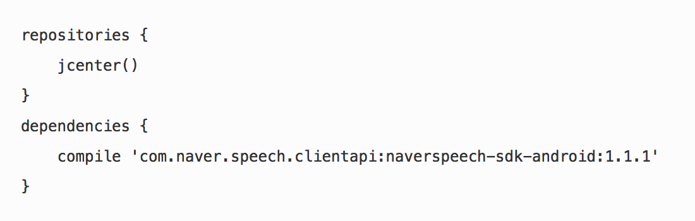
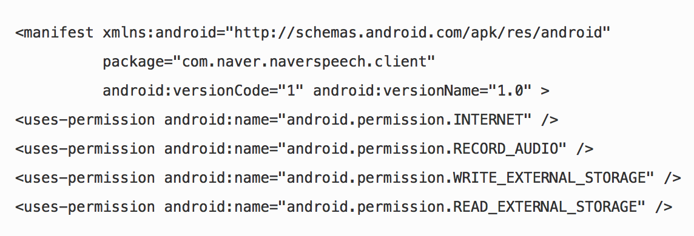
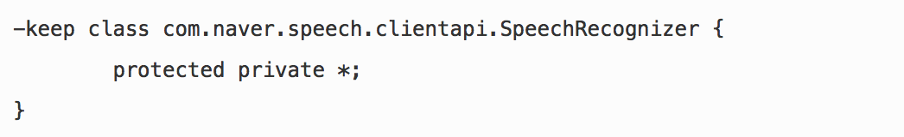
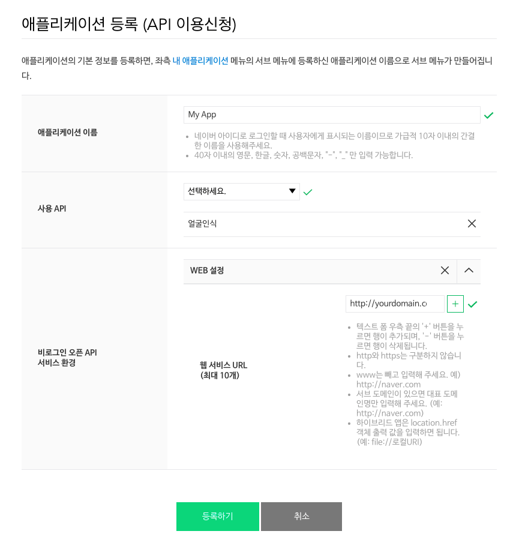
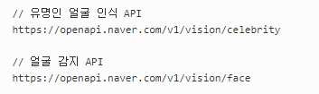
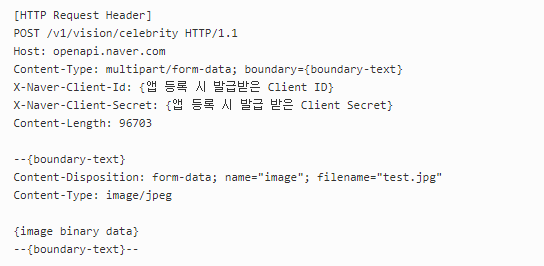
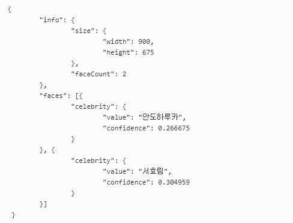
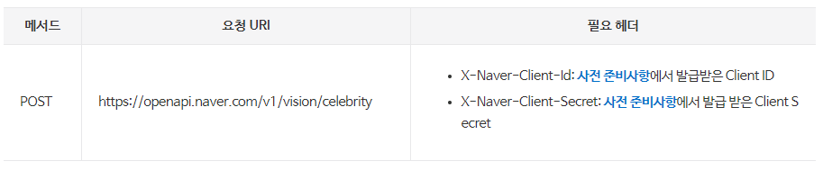

OSS 메뉴얼작성 프로젝트

CLOVA 메뉴얼
==================

###### 조장 : 김민재, 조원 : 정준영, 서대원

******************
목차
==================
1. CLOVA 란?
2. CSR
3. CSS
4. CFR
5. UX 고려사항
******************
CLOVA 란?
==================
콘텐츠 개발자 혹은 회사들이 음성기반 기능을 구현할 수 있도록 도와준다. 개발자들이 간단한 설정 및 코드 작성 만으로도 짧은 시간안에 당신만의 App에 Clova에 추가할 수 있다. 자연어 처리에 대해서 잘 알지 못하더라도 새로운 음성 기반의 서비스를 구현 가능하게 해준다. Clova Extensions Kit은 무료로 제공되며 더 많은 사용자들과 만날 수 있는 기회를 제공합니다.

******************
CSR
==================

CSR API란?
------------------
CSR은 Clova Speech Recognition의 약자로써 음성 입력을 스트리밍 형태로 입력받은 후 음성 인식한 결과를 텍스트로 반환한다. CSR API는 사용자 음성 입력을 전달 받기 위해 자체 개발한 스트리밍 프로토콜을 사용중이다 따라서, HTTP기반의 REST API형태가 아니라 Android SDK형태로 CSR API를 제공하고 있다.

사전 준비사항
------------------
CSR API를 사용하려면 개발하려는 애플리케이션을 네이버 개발자 센터에 등록해야 한다. 이때, 사용할 API에 대한 권한을 설정해야하며 ,API 사용 시 필요한 인증 정보를 획득해야 합니다. 애플리케이션 등록을 참고하여 다음과 같이 필요한 사항을 미리 준비해야한다.

    1. 애플리케이션 등록하기를 통해 앱 등록 페이지로 이동합니다.
    2. 사용 API에서 음성인식(CSR API)을 선택합니다.
    3. 비로그인 오픈 API 서비스 환경에 개발하는 앱 정보를 입력합니다.
    4. 등록하기 버튼을 클릭합니다.
    
API 사용하기
------------------
1. 다음 구문을 app/build.gradle 파일에 추가한다.

2. 다음과 같이 Android Manifest파일을 설정한다.
<pre>
    * 패키지 이름 : manifest 요소의 package 속성 값이 사전 준비사항에서 등록한 안드로이드 앱 패키지 이름과 같아야 합니다.
    
    * 권한 설정 : 사용자의 음성 입력을 마이크를 통해 녹음해야 하고 녹음된 데이터를 서버로 전송해야 합니다. 따라서, android.permission.INTERNET와 android.permission.RECORD_AUDIO에 대한 권한이 반드시 필요합니다.
</pre>

3. (선택) proguard-rules.pro 파일에 다음을 추가합니다. 아래 코드는 앱을 보다 가볍고 안전하게 만들어줍니다.

구현 예제
-------------------
<code>
   
    public class MainActivity extends Activity {
	private static final String TAG = MainActivity.class.getSimpleName();
	private static final String CLIENT_ID = "YOUR CLIENT ID"; // "내 애플리케이션"에서 Client ID를 확인해서 이곳에 적어주세요.
    private RecognitionHandler handler;
    private NaverRecognizer naverRecognizer;
    private TextView txtResult;
    private Button btnStart;
    private String mResult;
    private AudioWriterPCM writer;
    // Handle speech recognition Messages.
    private void handleMessage(Message msg) {
        switch (msg.what) {
            case R.id.clientReady: // 음성인식 준비 가능
                txtResult.setText("Connected");
                writer = new AudioWriterPCM(Environment.getExternalStorageDirectory().getAbsolutePath() + "/NaverSpeechTest");
                writer.open("Test");
                break;
            case R.id.audioRecording:
                writer.write((short[]) msg.obj);
                break;
            case R.id.partialResult:
                mResult = (String) (msg.obj);
                txtResult.setText(mResult);
                break;
            case R.id.finalResult: // 최종 인식 결과
            	SpeechRecognitionResult speechRecognitionResult = (SpeechRecognitionResult) msg.obj;
            	List<String> results = speechRecognitionResult.getResults();
            	StringBuilder strBuf = new StringBuilder();
            	for(String result : results) {
            		strBuf.append(result);
            		strBuf.append("\n");
            	}
                mResult = strBuf.toString();
                txtResult.setText(mResult);
                break;
            case R.id.recognitionError:
                if (writer != null) {
                    writer.close();
                }
                mResult = "Error code : " + msg.obj.toString();
                txtResult.setText(mResult);
                btnStart.setText(R.string.str_start);
                btnStart.setEnabled(true);
                break;
            case R.id.clientInactive:
                if (writer != null) {
                    writer.close();
                }
                btnStart.setText(R.string.str_start);
                btnStart.setEnabled(true);
                break;
        }
    }

    @Override
    protected void onCreate(Bundle savedInstanceState) {
        super.onCreate(savedInstanceState);
        setContentView(R.layout.activity_main);
        txtResult = (TextView) findViewById(R.id.txt_result);
        btnStart = (Button) findViewById(R.id.btn_start);
        handler = new RecognitionHandler(this);
        naverRecognizer = new NaverRecognizer(this, handler, CLIENT_ID);
        btnStart.setOnClickListener(new View.OnClickListener() {
            @Override
            public void onClick(View v) {
                if(!naverRecognizer.getSpeechRecognizer().isRunning()) {
                    mResult = "";
                    txtResult.setText("Connecting...");
                    btnStart.setText(R.string.str_stop);
                    naverRecognizer.recognize();
                } else {
                    Log.d(TAG, "stop and wait Final Result");
                    btnStart.setEnabled(false);
                    naverRecognizer.getSpeechRecognizer().stop();
                }
            }
        });
    }
    @Override
    protected void onStart() {
    	super.onStart(); // 음성인식 서버 초기화는 여기서
    	naverRecognizer.getSpeechRecognizer().initialize();
    }
    @Override
    protected void onResume() {
        super.onResume();
        mResult = "";
        txtResult.setText("");
        btnStart.setText(R.string.str_start);
        btnStart.setEnabled(true);
    }
    @Override
    protected void onStop() {
    	super.onStop(); // 음성인식 서버 종료
    	naverRecognizer.getSpeechRecognizer().release();
    }
    // Declare handler for handling SpeechRecognizer thread's Messages.
    static class RecognitionHandler extends Handler {
        private final WeakReference<MainActivity> mActivity;
        RecognitionHandler(MainActivity activity) {
            mActivity = new WeakReference<MainActivity>(activity);
        }
        @Override
        public void handleMessage(Message msg) {
            MainActivity activity = mActivity.get();
            if (activity != null) {
                activity.handleMessage(msg);
            }
        }
    }
    }
    class NaverRecognizer implements SpeechRecognitionListener {
        private final static String TAG = NaverRecognizer.class.getSimpleName();
        private Handler mHandler;
        private SpeechRecognizer mRecognizer;
        public NaverRecognizer(Context context, Handler handler, String clientId) {
            this.mHandler = handler;
            try {
                mRecognizer = new SpeechRecognizer(context, clientId);
            } catch (SpeechRecognitionException e) {
                e.printStackTrace();
            }
            mRecognizer.setSpeechRecognitionListener(this);
        }
        public SpeechRecognizer getSpeechRecognizer() {
            return mRecognizer;
        }
        public void recognize() {
            try {
                mRecognizer.recognize(new SpeechConfig(LanguageType.KOREAN, EndPointDetectType.AUTO));
            } catch (SpeechRecognitionException e) {
                e.printStackTrace();
            }
        }
        @Override
        @WorkerThread
        public void onInactive() {
            Message msg = Message.obtain(mHandler, R.id.clientInactive);
            msg.sendToTarget();
        }
        @Override
        @WorkerThread
        public void onReady() {
            Message msg = Message.obtain(mHandler, R.id.clientReady);
            msg.sendToTarget();
        }
        @Override
        @WorkerThread
        public void onRecord(short[] speech) {
            Message msg = Message.obtain(mHandler, R.id.audioRecording, speech);
            msg.sendToTarget();
        }
        @Override
        @WorkerThread
        public void onPartialResult(String result) {
            Message msg = Message.obtain(mHandler, R.id.partialResult, result);
            msg.sendToTarget();
        }
        @Override
        @WorkerThread
        public void onEndPointDetected() {
            Log.d(TAG, "Event occurred : EndPointDetected");
        }
        @Override
        @WorkerThread
        public void onResult(SpeechRecognitionResult result) {
            Message msg = Message.obtain(mHandler, R.id.finalResult, result);
            msg.sendToTarget();
        }
        @Override
        @WorkerThread
        public void onError(int errorCode) {
            Message msg = Message.obtain(mHandler, R.id.recognitionError, errorCode);
            msg.sendToTarget();
        }
        @Override
        @WorkerThread
        public void onEndPointDetectTypeSelected(EndPointDetectType epdType) {
            Message msg = Message.obtain(mHandler, R.id.endPointDetectTypeSelected, epdType);
            msg.sendToTarget();
        }
    }

</code>
******************
CSS
==================

### CSS API란?
------------------
Clova Speech Synthesis API는 음성으로 변환할 텍스트를 입력받은 후 파라미터로 지정된 음색과 속도로 음성을 합성하여 그 결과를 되돌려준다. 이는 HTTP(하이퍼 미디어 환경에서 빠르고 간편하게 데이터를 전송하는 프로토콜) 기반의 REST API 이며, 사용자 인증인 로그인이 필요하지 않은 비로그인 Open API 이다.

### 사전 준비사항
-------------------
    1. 사용 API에서 CSS API 선택.
    2. 개발하려는 애플리케이션을 네이버 개발자 센터에 등록.
    3. 등록 시 API에 대한 권한 설정 및 필요한 인증 정보 획득.
    4. 등록 후 내 애플리케이션 메뉴로 이동 후 등록한 앱의 정보 확인.
        (Client ID, Client Secret)
   

### CSS API 사용하기
---------------
1.__음성 합성할 텍스트 데이터를 HTTP 통신으로 음성 합성 서버에 전달.__

(음성 합성 서버가 제공하는 REST API URI는 다음과 같으며, POST 방식으로 연결.)

        <http://openapi.naver.com/v1/voice/tts.bin>

2.__사전 준비사항에서 발급받은 client ID와 client Secret 정보를 헤더에 포함시킨다.__

다음과 같이 HTTP 요청 헤더를 구성할 수 있다.

   

        [HTTP Request Header]
        POST /v1/voice/tts.bin HTTP/1.1 
        Host: openapi.naver.com
        Content-Type: application/x-www-form-urlencoded; charset=UTF-8
        X-Naver-Client-Id: {Client ID}
        X-Naver-Client-Secret: {Client Secret}

3.__HTTP 요청 본문에는 음성 합성할 텍스트, 목소리 종류와 속도도 정의 할 수 있다.__

다음은  "만나서 반갑습니다."를 일반 속도의 여성 목소리로 합성한 예제이다.

        [HTTP Request Body]
        speaker=mijin&speed=0&text=만나서 반갑습니다.

위와 같은 HTTP 요청을 음성 합성 서버로 전달하면 서버는 MP3 형식의 바이너리 데이터를 HTTP 응답 메시지로 반환해준다.

4.__전달받은 음성 데이터를 재생하여 스피커로 출력__

다음은 HTTP 응답 예제이다.

            [HTTP Response Header]
            HTTP/1.1 200 OK
            Server: nginx
            Date: Wed, 28 Sep 2016 06:51:49 GMT
            Content-Type: audio/mpeg;charset=utf-8
            Content-Length: 19794
            Connection: keep-alive
            Keep-Alive: timeout=5
            X-QUOTA: 10
            [HTTP Response Body]
            {MP3 형식의 바이너리 데이터}
***
CSS API 레퍼런스
---
### 기본 정보
---
__CSS API의 요청 URl 및 요청에 필요한 헤더 정보는 아래와 같다.__
<table>
    <tr align ="center"><td>__메서드__</td><td>__요청 URl__</td><td>__필요 헤더__</td></tr>
    <tr align ="center"><td>POST</td><td>https://openapi.naver.com/v1/voice/tts.bin</td><td>1. X-Naver-Client-Id: 사전 준비사항에서 발급받은 Client ID
    
2. X-Naver-Client-Secret: 사전 준비사항에서 발급 받은 Client Secret

</td></tr>
</table>

### 요청 파라미터
---
CSS API에 필요한 요청 헤더를 본문에 입력하여 본문에 아래와 같이 파라미터를 작성해야한다. __작성하지 않을 시에는 오류가 발생한다.__

    [HTTP Request Body]
    speaker={string}&speed={integer}&text={string}
 다음은 파라미터에 대한 간단한 설명이다.

  

***
구현 예제
---
구현 예제는 Java, php 이 두가지에 대해서만 보이겠다. 나머지 Node.js , Python, c# 같은 예제는 필요에 따라서 검색하여 참고바람. 다음은 네이버 음성합성 Open API에 대한 예제이다.

## 1. Java

~~~

import java.io.*;
import java.net.HttpURLConnection;
import java.net.URL;
import java.net.URLEncoder;
import java.util.Date;

public class APIExamTTS {

    public static void main(String[] args) {
        String clientId = "YOUR_CLIENT_ID";//애플리케이션 클라이언트 아이디값";
        String clientSecret = "YOUR_CLIENT_SECRET";//애플리케이션 클라이언트 시크릿값";
        try {
            String text = URLEncoder.encode("만나서 반갑습니다.", "UTF-8"); // 13자
            String apiURL = "https://openapi.naver.com/v1/voice/tts.bin";
            URL url = new URL(apiURL);
            HttpURLConnection con = (HttpURLConnection)url.openConnection();
            con.setRequestMethod("POST");
            con.setRequestProperty("X-Naver-Client-Id", clientId);
            con.setRequestProperty("X-Naver-Client-Secret", clientSecret);
            // post request
            String postParams = "speaker=mijin&speed=0&text=" + text;
            con.setDoOutput(true);
            DataOutputStream wr = new DataOutputStream(con.getOutputStream());
            wr.writeBytes(postParams);
            wr.flush();
            wr.close();
            int responseCode = con.getResponseCode();
            BufferedReader br;
            if(responseCode==200) { // 정상 호출
                InputStream is = con.getInputStream();
                int read = 0;
                byte[] bytes = new byte[1024];
                // 랜덤한 이름으로 mp3 파일 생성
                String tempname = Long.valueOf(new Date().getTime()).toString();
                File f = new File(tempname + ".mp3");
                f.createNewFile();
                OutputStream outputStream = new FileOutputStream(f);
                while ((read =is.read(bytes)) != -1) {
                    outputStream.write(bytes, 0, read);
                }
                is.close();
            } else {  // 에러 발생
                br = new BufferedReader(new InputStreamReader(con.getErrorStream()));
                String inputLine;
                StringBuffer response = new StringBuffer();
                while ((inputLine = br.readLine()) != null) {
                    response.append(inputLine);
                }
                br.close();
                System.out.println(response.toString());
            }
        } catch (Exception e) {
            System.out.println(e);
        }
    }
}

~~~

## 2. PHP
~~~
<?php
  $client_id = "YOUR_CLIENT_ID";
  $client_secret = "YOUR_CLIENT_SECRET";
  $encText = urlencode("반갑습니다.");
  $postvars = "speaker=mijin&speed=0&text=".$encText;
  $url = "https://openapi.naver.com/v1/voice/tts.bin";
  $is_post = true;
  $ch = curl_init();
  curl_setopt($ch, CURLOPT_URL, $url);
  curl_setopt($ch, CURLOPT_POST, $is_post);
  curl_setopt($ch, CURLOPT_RETURNTRANSFER, true);
  curl_setopt($ch,CURLOPT_POSTFIELDS, $postvars);
  $headers = array();
  $headers[] = "X-Naver-Client-Id: ".$client_id;
  $headers[] = "X-Naver-Client-Secret: ".$client_secret;
  curl_setopt($ch, CURLOPT_HTTPHEADER, $headers);
  $response = curl_exec ($ch);
  $status_code = curl_getinfo($ch, CURLINFO_HTTP_CODE);
  echo "status_code:".$status_code." ";
  curl_close ($ch);
  if($status_code == 200) {
    //echo $response;
    $fp = fopen("tts.mp3", "w+");
    fwrite($fp, $response);
    fclose($fp);
    echo "<a href='tts.mp3'>TTS재생</a>";
  } else {
    echo "Error 내용:".$response;
  }
?>
~~~

***
참고 사항
---
text 필드에 음성 합성할 문장을 입력 시, 쉼표를 넣으면 결과에서 해당 부분을 잠시 쉬었다가 말하게 되며, 마침표와 개행 문자를 연속 입력(.\n)하면 구분된 문장으로 합성 결과를 보내준다. 

다음은 두 문장으로 구분되고, 첫 번째 문장의 수미표에서 한번 쉬다가 읽는 예제이다.

    여자친구랑 싸우고, 여자친구는 울었다.\n나는 당황 했다.

# Clova Face Recognition API 가이드 
-------------------
## CFR API란?

Clova Face Recognition API(CFR API)는 이미지 데이터를 입력받은 후 얼굴 인식 결과를 JSON 형태로 반환한다. CFR API는 이미지에 있는 얼굴을 인식하여 분석 정보를 제공하는 얼굴 감지 API와 닮은 연예인을 알려주는 유명인 얼굴 인식 API를 제공한다. CFR API는 HTTP 기반의 REST API이며, 사용자 인증(로그인)이 필요하지 않은 비로그인 Open API이다.

***
## 사전 준비사항

CFR API를 사용하려면 개발하려는 애플리케이션을 네이버 개발자 센터에 등록해야 한다. 이때, 사용할 API에 대한 권한을 설정해야 하며, API 사용 시 필요한 정보를 획득해야 한다. 애플리케이션 등록을 참고하여 다음과 같이 필요한 사항을 미리 준비한다.

---

## 애플리케이션 등록(API 이용신청)

애플리케이션의 기본 정보를 등록하면, 좌측 내 어플리케이션 메뉴의 서브 메뉴의 등록한 애플리케이션 이름으로 서브 메뉴가 만들어진다.

1. **애플리케이션 등록하기**를 통해 앱 등록 페이지로 이동한다.
2. **사용 API**에서 **얼굴인식**(CFR API)를 선택한다.
3. **비로그인 오픈 API서비스 환경**에 **WEB 설정**을 추가하고 웹 애플리케이션의 **웹 서비스 URL**을 입력한다.
4. **등록하기** 버튼을 클릭하면 **내 애플리케이션** 메뉴로 이동하며 방금 등록한 앱의 정보가 화면에 표시된다. 이 페이지에서 **Client ID**와 **Client Secret** 정보를 확인할 수 있다.

***

## CFR API 사용하기

CFR API는 REST API이며, 얼굴 인식을 수행할 이미지 데이터를 HTTP 통신으로 음성 합성 서버에 전달한다. 음성 합성 서버가 제공하는 REST API의 URI는 다음과 같으며 POST 방식으로 연결을 시도해야 한다.

HTTP 요청으로 얼굴 인식을 요청할 때 **사전 준비사항**에서 발급받은 Client ID와 Client Secret 정보를 헤더에 포함시켜야 한다. 또한 요청을 multipart 형식으로 보내야 하며, 메시지의 이름은 image여야 한다. 다음은 유명인 얼굴 인식 API를 호출할 때 보내는 HTTP 요청 메시지의 예이다.

위와 같은 HTTP 요청을 얼굴 인식 서버로 전달하면 얼굴 인식 서버는 JSON 형태의 분석 결과 데이터를 HTTP 응답 메시지로 반환합니다. 다음은 응답 예제이다.

위와 같은 방식으로 얼굴 감지 API도 사용할 수 있으며, API별 분석 결과에 따라 응답 메시지로 전달되는 JSON 데이터의 내용이 달라진다. 이에 자세한 명세는 **CFR API 레퍼런스**를 참조한다.

***

## 구현 예제
    
    import java.io.*;
    import java.net.HttpURLConnection;
    import java.net.URL;
    import java.net.URLConnection;

    public class APIExamFace {

    public static void main(String[] args) {

        StringBuffer reqStr = new StringBuffer();
        String clientId = "YOUR_CLIENT_ID";//애플리케이션 클라이언트 아이디값";
        String clientSecret = "YOUR_CLIENT_SECRET";//애플리케이션 클라이언트 시크릿값";

        try {
            String paramName = "image"; // 파라미터명은 image로 지정
            String imgFile = "이미지 파일 경로 ";
            File uploadFile = new File(imgFile);
            String apiURL = "https://openapi.naver.com/v1/vision/celebrity"; // 유명인 얼굴 인식
            //String apiURL = "https://openapi.naver.com/v1/vision/face"; // 얼굴 감지
            URL url = new URL(apiURL);
            HttpURLConnection con = (HttpURLConnection)url.openConnection();
            con.setUseCaches(false);
            con.setDoOutput(true);
            con.setDoInput(true);
            // multipart request
            String boundary = "---" + System.currentTimeMillis() + "---";
            con.setRequestProperty("Content-Type", "multipart/form-data; boundary=" + boundary);
            con.setRequestProperty("X-Naver-Client-Id", clientId);
            con.setRequestProperty("X-Naver-Client-Secret", clientSecret);
            OutputStream outputStream = con.getOutputStream();
            PrintWriter writer = new PrintWriter(new OutputStreamWriter(outputStream, "UTF-8"), true);
            String LINE_FEED = "\r\n";
            // file 추가
            String fileName = uploadFile.getName();
            writer.append("--" + boundary).append(LINE_FEED);
            writer.append("Content-Disposition: form-data; name=\"" + paramName + "\"; filename=\"" + fileName + "\"").append(LINE_FEED);
            writer.append("Content-Type: "  + URLConnection.guessContentTypeFromName(fileName)).append(LINE_FEED);
            writer.append(LINE_FEED);
            writer.flush();
            FileInputStream inputStream = new FileInputStream(uploadFile);
            byte[] buffer = new byte[4096];
            int bytesRead = -1;
            while ((bytesRead = inputStream.read(buffer)) != -1) {
                outputStream.write(buffer, 0, bytesRead);
            }
            outputStream.flush();
            inputStream.close();
            writer.append(LINE_FEED).flush();
            writer.append("--" + boundary + "--").append(LINE_FEED);
            writer.close();
            BufferedReader br = null;
            int responseCode = con.getResponseCode();
            if(responseCode==200) { // 정상 호출
                br = new BufferedReader(new InputStreamReader(con.getInputStream()));
            } else {  // 에러 발생
                System.out.println("error!!!!!!! responseCode= " + responseCode);
                br = new BufferedReader(new InputStreamReader(con.getInputStream()));
            }
            String inputLine;
            if(br != null) {
                StringBuffer response = new StringBuffer();
                while ((inputLine = br.readLine()) != null) {
                    response.append(inputLine);
                }
                br.close();
                System.out.println(response.toString());
            } else {
                System.out.println("error !!!");
            }
        } catch (Exception e) {
            System.out.println(e);
        }
    }
    }

##CFR API 레퍼런스

* 유명인 얼굴 인식 API
* 얼굴 감지 API

#유명인 얼굴 인식 API
입력받은 이미지로부터 얼굴을 감지하고 감지한 얼굴이 어떤 유명인과 닮았는지 분석하여 그 결과를 반환하는 REST API이다. 이미지에서 다음과 같은 정보를 분석한다.

* 감지된 얼굴의 수
* 감지된 각 얼굴을 분석한 정보
 * 닮은 유명인 이름
 * 해당 유명인을 닮은 정도

# 기본 정보
유명인 얼굴 인식 API의 요청 URI 및 요청에 필요한 헤더 정보는 다음과 같다.

# 요청 파라미터
Multipart 메시지에 이름이 *image*라는 메시지로 이미지의 바이너리 데이터를 전달해야 한다. **최대 2MB의 이미지 데이터를 지원**한다. 다음은 헤더를 포함한 HTTP 요청 예제이다.

	<code>
	[HTTP Request Header]
	POST /v1/vision/celebrity HTTP/1.1
	Host: openapi.naver.com
	Content-Type: multipart/form-data; boundary={boundary-text}
	X-Naver-Client-Id: {앱 등록 시 발급받은 Client ID}
	X-Naver-Client-Secret: {앱 등록 시 발급 받은 Client Secret}
	Content-Length: 96703
	
	--{boundary-text}
	Content-Disposition: form-data; name="image"; filename="test.jpg"
	Content-Type: image/jpeg
	
	{image binary data}
	--{boundary-text}--

# 응답
얼굴 감지 API는 분석한 결과를 JSON 형식의 데이터로 반환합니다. JSON 응답의 각 필드에 대한 설명은 다음과 같다.

|   필드 이름	|   데이터 타입		|   설명	|
|---	|---	|---	|
| info  	|   object	|   입력된 이미지 크기와 인식된 얼굴의 개수 정보를 가지는 객체	|
|   info.size	|   place object	|   입력된 이미지의 크기 정보를 가지는 객체	|
|   info.faceCount	| number  	|   닮은 유명인의 수	|
|   faces[]	|   object array	|   닮은 유명인별 분석 결과를 가지는 객체 배열	|
|   faces[].celebrity	|   	object|   닮은 유명인의 정보를 가지는 객체	|
|   faces[].celebrity.value	|   string	|   닮은 유명인의 이름	|
|   faces[].celebrity.confidence	|   	number|   해당 유명인과 닮았음을 확신하는 정도. 0에서 1사이의 실수로 표현됩니다. 1에 가까울수록 높은 확신을 나타냅니다.	|

다음은 얼굴 감지 API 요청에 대한 응답의 예이다.

		// 닮은 유명인을 찾은 경우
	{
 	"info": {
 	  "size": {
  	   "width": 900,
  	   "height": 675
  	 },
 	  "faceCount": 2
 	},
 	"faces": [{
 	  "celebrity": {
 	    "value": "안도하루카",
  	   "confidence": 0.266675
  	 }
	 }, {
 	  "celebrity": {
  	   "value": "서효림",
   	  "confidence": 0.304959
  	 }
	 }]
	}
	
	// 닮은 유명인을 찾지 못한 경우
	{
		"info": {
			"size": {
				"width": 768,
				"height": 1280
			},
			"faceCount": 0
		},
		"faces": []
	}

# 얼굴 감지 API 

입력받은 이미지로부터 얼굴을 감지하고 입력된 이미지에서 얼마나 많은 얼굴이 감지되었고 각 얼굴이 어디에 어떤 크기로 위치하며 어떤 모습을 하고 있는지 반환하는 REST API입니다. 이미지에서 다음과 같은 정보를 분석합니다.

* 감지된 얼굴의 수
* 감지된 각 얼굴을 분석한 정보
 * 감지된 각 얼굴의 좌표 및 크기
 * 감지된 각 얼굴의 눈, 코, 입의 좌표
 * 감지된 얼굴의 추정 성별 및 추정치
 * 감지된 얼굴의 추정 나이 및 추정치
 * 감지된 얼굴에서 분석된 감정
 * 감지된 얼굴의 방향

# 오류 코드

CFR API가 발생시킬 수 있는 오류코드는 다음과 같다.

# Place object
CFR API는 HTTP 응답의 JSON 데이터에 감지한 얼굴 및 얼굴의 부위를 표시하기 위해 다음과 같이 place 객체를 공유하여 사용합니다. 각 필드는 선택적이며, 크기 정보를 나타낼 때와 위치 정보를 나타낼 때 선택적으로 사용할 수 있다.

| 필드 이름  | 데이터 타입  |  설명 | 필수 여부  |
|---|---|---|---|
| width  | number  |  입력된 이미지, 인식된 얼굴의 너비 정보(px) | 선택  |
| height  | number  | 입력된 이미지, 인식된 얼굴의 높이 정보(px)  | 선택  |
|  x | number  | 인식된 얼굴 및 얼굴 부위의 위치 정보를 나타내기 위한 x 좌표(px). 기준점은 이미지의 좌상단 모서리  | 선택  |
|  y |  number | 인식된 얼굴 및 얼굴 부위의 위치 정보를 나타내기 위한 y 좌표(px). 기준점은 이미지의 좌상단 모서리  | 선택  |

***
UX 고려사항
===
일반적으로 사용자는 음성 인식 버튼을 누르자마자 발화를 시작하려고 할 것입니다. 하지만 음성 인식을 시작하는 recognize() 메서드를 호출하면 음성 인식을 위한 메모리 할당, 마이크 자원 할당, 음성 인식 서버 접속 및 인증 등의 준비 과정을 수행해야 하기 때문에 사용자의 발화 일부가 누락될 수 있습니다. 따라서, 앱은 모든 준비가 완료된 후 사용자에게 발화해도 좋다는 정보를 전달해야 합니다. 이 방법은 다음과 같이 처리할 수 있습니다.
    * 모든 준비가 완료되면 onReady callback 메서드가 호출됩니다.
    * onReady callback 메서드가 호출되기 전까지 "준비 중입니다."와 같은 메시지를 표시하거나 준비 중임을 나타내는 UI 표시를 해야 합니다.
    * onReady callback 메서드가 호출되면 "이야기해주요."와 같은 메시지를 표시하거나 사용 가능함을 나타내는 UI를 표시해야 합니다.
    * onReady callback 메서드가 호출되면 "이야기해주세요."와 같은 메시지를 표시하거나 사용 가능함을 나타내는 UI를 표시해야 합니다.

